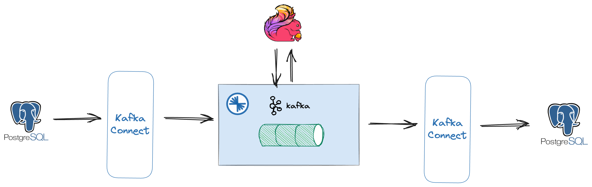

# kafka db pipeline demo 


## Prerequisites

* A recent version of Confluent Platform installed
* Linux or MacOS operating system 
* bash
* docker-compose
* access to docker hub

## overview 
Components used
* Kafka in KRaft Mode
* Schema Registry
* Kafka Connect
* Confluent Control Center
* Flink (Jobmanager, Taskmanager, SQLClient)
* Postgres 
* JDBC Source & Sink Connector
* Debezium Postgres Connector  




We will use JDBC Connector and Debezium Postgres Connector to get the data from Postgres to Kafka and back to Postgres.
Addiotionally using Flink to slightly manipulate the streams before sending them back to Postgres.


### start the stack

docker-compose up -d 

### preps in database

grant proper rights to postgres user

connect to database and execute script

```bash
docker exec postgres /bin/sh -c 'psql -U postgres  < /var/lib/postgresql/ddl/preps.sql'
```
Feedback should be 
```sql
ALTER ROLE
```
### populate some data in the database

examples taken & adapted from   
https://github.com/morenoh149/postgresDBSamples/blob/master/chinook-1.4/Chinook_PostgreSql_utf8.sql

load with
```bash 
docker exec postgres /bin/sh -c 'psql -U postgres  < /var/lib/postgresql/ddl/artist.sql'
docker exec postgres /bin/sh -c 'psql -U postgres  < /var/lib/postgresql/ddl/customer.sql'
```
### create jdbc source connector

Connector will publish data from Customer table to a Kafka topic named pg.jdbc.Customer.
Check with Control Center to see incoming messages.


```bash
curl -X PUT \
     -H "Content-Type: application/json" \
     --data '{
               "connector.class": "io.confluent.connect.jdbc.JdbcSourceConnector",
                    "tasks.max": "1",
                    "connection.url": "jdbc:postgresql://postgres/postgres?user=postgres&password=welcome12&ssl=false",
                    "table.whitelist": "Customer",
                    "mode": "timestamp+incrementing",
                    "timestamp.column.name": "update_ts",
                    "incrementing.column.name": "CustomerId",
                    "topic.prefix": "pg.jdbc.",
                    "validate.non.null":"false",
                    "errors.log.enable": "true",
                    "errors.log.include.messages": "true"
          }' \
     http://localhost:8083/connectors/postgres-source/config | jq .
```

### create debeezium postgres connector

Connector will publish data from Artist table to a Kafka topic named cdc.public.Artist.
Check with Control Center to see incoming messages.

```bash
curl --location 'http://localhost:8083/connectors' \
   --header 'Accept: application/json' \
   --header 'Content-Type: application/json' \
   --data '{
   "name": "cdc-using-debezium-connector",
   "config": {
       "connector.class": "io.debezium.connector.postgresql.PostgresConnector",
       "database.hostname": "postgres",
       "database.port": "5432",
       "database.user": "postgres",
       "database.password": "welcome12",
       "database.dbname": "postgres",
       "table.include.list": "public.Artist",
       "topic.prefix": "cdc",
       "plugin.name": "pgoutput"
   }
}'
```

### Use Flink to work with the incoming data

start a flink sql cli

```bash
docker-compose run sql-client
```

create table in flink 

```sql
CREATE TABLE customer
(
    CustomerId INT ,
    FirstName STRING,
    LastName STRING,
    Company STRING,
    Address STRING,
    City STRING,
    State STRING,
    Country STRING,
    PostalCode STRING,
    Phone STRING,
    Fax STRING,
    Email STRING,
    SupportRepId INT,
    update_ts timestamp(3))
    WITH (
    'connector' = 'kafka',
    'topic' = 'pg.jdbc.Customer',
    'properties.bootstrap.servers' = 'broker:29092',
    'scan.startup.mode' = 'earliest-offset',
    'properties.replication.factor' = '1',
    'value.format' = 'avro-confluent',
    'value.avro-confluent.url'='http://schema-registry:8081'
);

```
create another which will populated by customer table created above

```sql
create table demo
(
FirstName STRING,
LastName STRING,
Email String
)
    WITH (
    'connector' = 'kafka',
    'topic' = 'pg-sink',
    'properties.bootstrap.servers' = 'broker:29092',
    'scan.startup.mode' = 'earliest-offset',
    'properties.replication.factor' = '1',
    'value.format' = 'avro-confluent',
    'value.avro-confluent.url'='http://schema-registry:8081'
);
```
populate the table with data from customer table
```sql
INSERT INTO demo SELECT FirstName, LastName, Email from customer;
```


### jdbc sink to send data back to postgres
```bash
curl -X PUT \
     -H "Content-Type: application/json" \
     --data '{
               "connector.class": "io.confluent.connect.jdbc.JdbcSinkConnector",
                    "tasks.max": "1",
                    "connection.url": "jdbc:postgresql://postgres/postgres?user=postgres&password=welcome12&ssl=false",
                    "topics": "pg-sink",
                    "auto.create": "true"
          }' \
     http://localhost:8083/connectors/postgres-sink/config | jq .
```

Data will collected from our pg-sink topic and sent to postgres table *pg-sink*.


### Links

#### Kafka Connect
https://docs.confluent.io/kafka-connectors/jdbc/current/source-connector/overview.html#load-the-jdbc-source-connector

https://debezium.io/documentation/reference/1.1/connectors/postgresql.html#postgresql-connector-properties

#### Flink
https://nightlies.apache.org/flink/flink-docs-release-1.18/

https://nightlies.apache.org/flink/flink-docs-release-1.18/docs/dev/table/sql/create/

https://nightlies.apache.org/flink/flink-docs-release-1.18/docs/connectors/table/formats/overview/

#### Kafka


#### Confluent Platform
